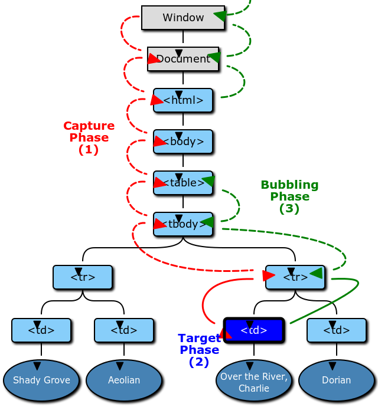

# 事件傳遞

### TL;DR

- 事件傳遞可以依序分為三個階段：捕獲（capturing）、目標（target）、冒泡（bubbling）。
- `event.stopPropagation` 用來取消事件的傳遞，`event.preventDefault` 則用來取消瀏覽器預設的行為。
- `event.target` 為最初觸發事件的元素，`event.currentTarget` 為當前事件傳遞時被綁定的元素。
- 事件代理（event delegation）是一種技巧，讓父元素處理子元素的事件，而不是每個子元素都有自己的事件處理器。

### 什麼是事件傳遞

事件傳遞指的是事件通過 DOM tree 傳遞的方式。

事件傳遞可以分為三個階段：

1. 捕獲（Capturing）：事件由**最外層的元素開始向下傳遞**，直到找到觸發事件的元素。
2. 目標（Target）：事件會在找到觸發事件的元素後停止傳遞，然後在該元素上執行其事件處理器。
3. 冒泡（Bubbling）：事件由**觸發事件的元素往上傳遞**，直到回到最外層的元素。



### 捕獲階段（Capturing）

當使用  `addEventListener(event, handler)`  的時候，**預設只會監聽目標和冒泡階段**，如果要監聽捕獲階段，就必須在  `addEventListener()`  中第三個參數代入  `true`。

```html
<body>
  <button>button</button>
</body>

<script>
  const body = document.querySelector('body');
  const button = document.querySelector('button');

  body.addEventListener(
    'click',
    function (e) {
      console.log('body');
    },
    true,
  );

  button.addEventListener(
    'click',
    function (e) {
      console.log('button');
    },
    true,
  );

  // 當 button 被點擊時，由於 eventListener 第三個參數為 true
  // 會監聽捕獲事件，因此依序印出 body, button
</script>
```

### 冒泡階段（Bubbling）

```html
<body onclick="console.log('body')">
  <div onclick="console.log('div')">
    <button onclick="console.log('button')">button</button>
  </div>
</body>
<!-- 當 button 被點擊時，依序印出 'button' 'div' 'body' -->
<!-- 印出 'div' 和 'body' 是由於事件向上冒泡 -->
```

### `event.stopPropagation`

實務上，我們有時候不想要事件傳遞，只想要目標元素的事件被觸發，不想繼續觸發上層元素的事件處理器。

這時候我們可以加上 `event.stopPropagation()` 來取消事件傳遞。

```html
<body>
  <button>button</button>
</body>

<script>
  const body = document.querySelector('body');
  const button = document.querySelector('button');

  body.addEventListener('click', function (e) {
    console.log('body');
  });

  button.addEventListener('click', function (e) {
    e.stopPropagation();
    console.log('button');
  });

  // 當 button 被點擊時，由於 e.stopPropagation，事件將不會繼續冒泡，因此只會印出 'button'
</script>
```

:::caution 注意
如果在**捕獲階段取消事件傳遞**，後續的目標、冒泡階段皆不會發生。
:::

```html
<body>
  <button>button</button>
</body>

<script>
  const body = document.querySelector('body');
  const button = document.querySelector('button');

  body.addEventListener(
    'click',
    function (e) {
      e.stopPropagation();
      console.log('capturing body');
    },
    true,
  );

  button.addEventListener(
    'click',
    function (e) {
      console.log('capturing button');
    },
    true,
  );

  body.addEventListener('click', function (e) {
    console.log('body');
  });

  button.addEventListener('click', function (e) {
    console.log('button');
  });

  // 當 button 被點擊時，由於捕獲階段就取消事件繼續傳遞，因此只會印出 'capturing body'
</script>
```

### `event.preventDefault`

`event.preventDefault()` 用於取消事件相關聯的瀏覽器預設行為，例如連結跳轉頁面或提交表單，它不會影響事件傳遞。

如下方程式碼所示，當點擊 `<a>` 時，瀏覽器的預設行為是跳轉到另一個頁面。

然而，使用 `event.preventDefault()` 可以取消此預設行為，使開發人員能夠執行所需的行為。

```js
const link = document.querySelector('a');

link.addEventListener('click', function (e) {
  e.preventDefault(); // 取消預設行為
  console.log('clicked'); // 執行開發人員所需的行為
});
```

### `event.target` vs. `event.currentTarget`

- `event.target`：觸發事件的元素，此元素在整個事件傳遞中不會改變。
- `event.currentTarget`：當前事件傳遞被綁定的元素，會隨著事件傳遞而改變，通常和 `this`  指的是同一個元素。

### 事件代理 （Event Delegation）

事件代理是利用事件傳遞的機制，將事件處理交給父層元素處理，從而減少事件監聽器的數量。

這可以提升程式碼的效能以及可讀性，尤其是在多個相同事件處理器的元素的情況下。

💩 在每個元素上加上事件處理器

```html
<ol id="list">
  <li data-num="1" onClick="console.log(this.dataset.num)">1</li>
  <li data-num="2" onClick="console.log(this.dataset.num)">2</li>
  <li data-num="3" onClick="console.log(this.dataset.num)">3</li>
  <li data-num="4" onClick="console.log(this.dataset.num)">4</li>
</ol>
```

✅ 在父層加上一個事件處理器，統一處理相同的事件

```html
<ol id="list">
  <li data-num="1">1</li>
  <li data-num="2">2</li>
  <li data-num="3">3</li>
  <li data-num="4">4</li>
</ol>

<script>
  const list = document.getElementById('list');

  list.addEventListener('click', (e) => {
    const li = e.target.closest('li');

    if (!li) return;

    console.log(li.dataset.num);
  });
</script>
```

參考來源:

1. [https://blog.techbridge.cc/2017/07/15/javascript-event-propagation/](https://blog.techbridge.cc/2017/07/15/javascript-event-propagation/)
2. [https://shubo.io/event-bubbling-event-capturing-event-delegation/](https://shubo.io/event-bubbling-event-capturing-event-delegation/)
3. [https://pjchender.dev/webapis/note-event-capturing-bubbling/](https://pjchender.dev/webapis/note-event-capturing-bubbling/)
