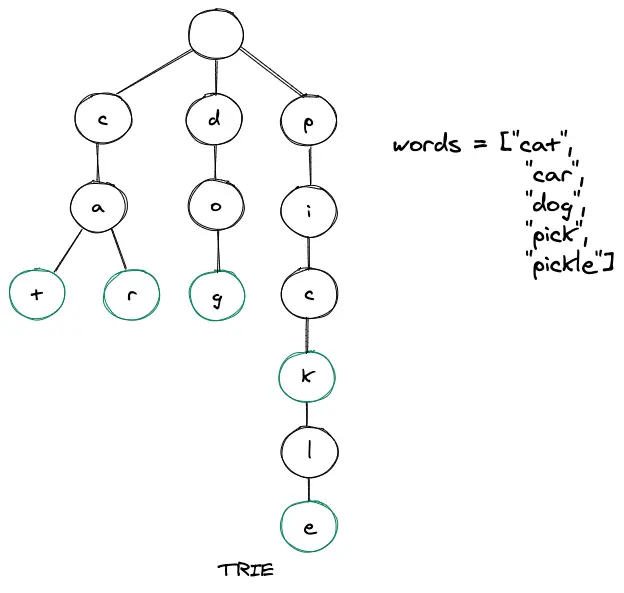

# Trie

### 什麼是 Trie

Trie（發音為 try），又稱為 Prefix Tree，是一種用於快速搜尋字串的資料結構，它通常是一個類似樹狀的結構，由於 Trie 可以快速找到符合匹配前綴的所有字串，經常用於 autocomplete 和 spell checker。

在 Trie 中，每個節點表示一個字母或字符。根節點表示一個空字符串，每個子節點表示字串中的一個字母或字符。以英文為例，Trie 每一層最多只會有 26 個字母。



### 為什麼要使用 Trie

試想一個情境，如果透過陣列的方式來實作字串搜尋，我們應該怎麼做 🤔

如果有 1000000 筆資料，要搜尋是否有前綴為 "ca" 的單字，必須檢查陣列裡所有的資料（跑 1000000 次迴圈）。

但是如果透過 Trie 來實作，則只需要檢查是否有 "ca" 兩個連續存在的節點即可（跑 2 次迴圈）。

### 實作

實作的 Trie 有以下三個方法：

1. `insert(word)`：將字串 word 插入到 Trie 物件中。
2. `search(word)`：查詢字串 word 是否在 Trie 物件中，如果存在返回 true，否則返回 false。
3. `startsWith(prefix)`：查詢是否有以字串 prefix 為前綴的字串在 Trie 物件中，如果存在返回 true，否則返回 false。

```jsx
// TrieNode 表示 Trie 中的一個節點
// 它具有一個 children 物件來存儲它的子節點，以及一個 endOfWord 來表示該節點是否為字串的結尾
class TrieNode {
  constructor() {
    this.children = new Map();
    this.endOfWord = false;
  }
}

class Trie {
  constructor() {
    this.root = new TrieNode();
  }

  insert(word) {
    let current = this.root;

    for (const char of word) {
      if (!current.children.has(char)) {
        current.children.set(char, new TrieNode());
      }

      current = current.children.get(char);
    }

    current.endOfWord = true;
  }

  search(word) {
    let current = this.root;

    for (const char of word) {
      if (!current.children.has(char)) {
        return false;
      }

      current = current.children.get(char);
    }

    return current.endOfWord;
  }

  startsWith(prefix) {
    let current = this.root;

    for (const char of prefix) {
      if (!current.children.has(char)) {
        return false;
      }

      current = current.children.get(char);
    }

    return true;
  }
}
```

參考來源:

1. [https://www.studytonight.com/advanced-data-structures/trie-data-structure-explained-with-examples](https://www.studytonight.com/advanced-data-structures/trie-data-structure-explained-with-examples)
2. [https://leetcode.com/problems/implement-trie-prefix-tree/description/](https://leetcode.com/problems/implement-trie-prefix-tree/description/)
